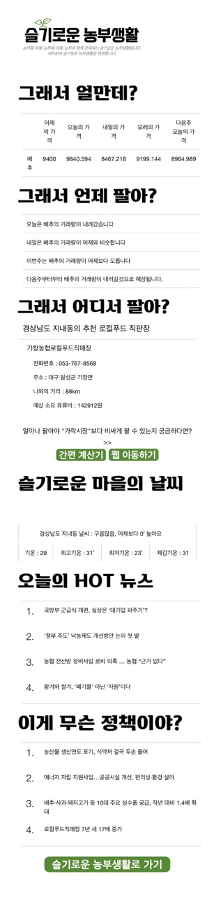
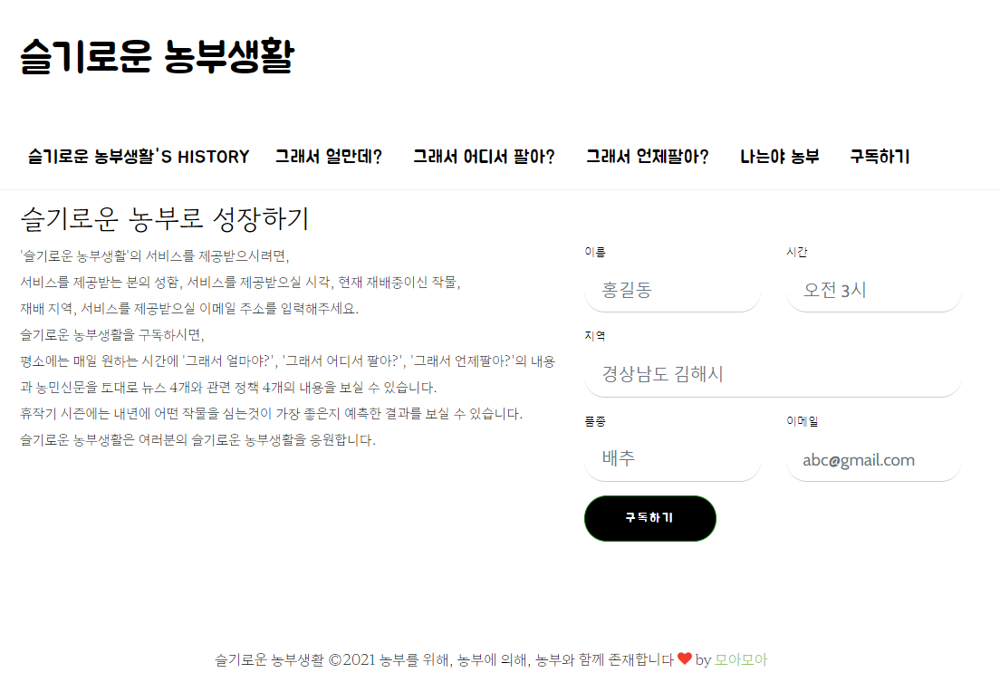
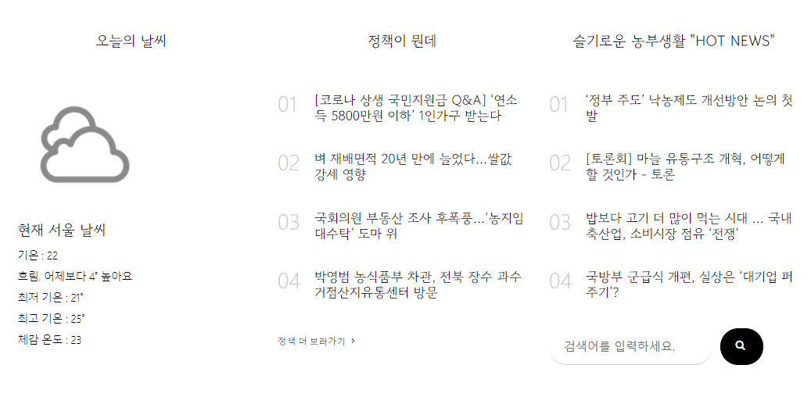
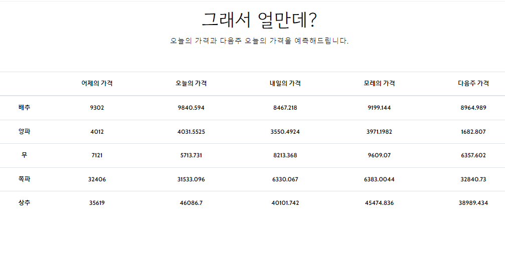
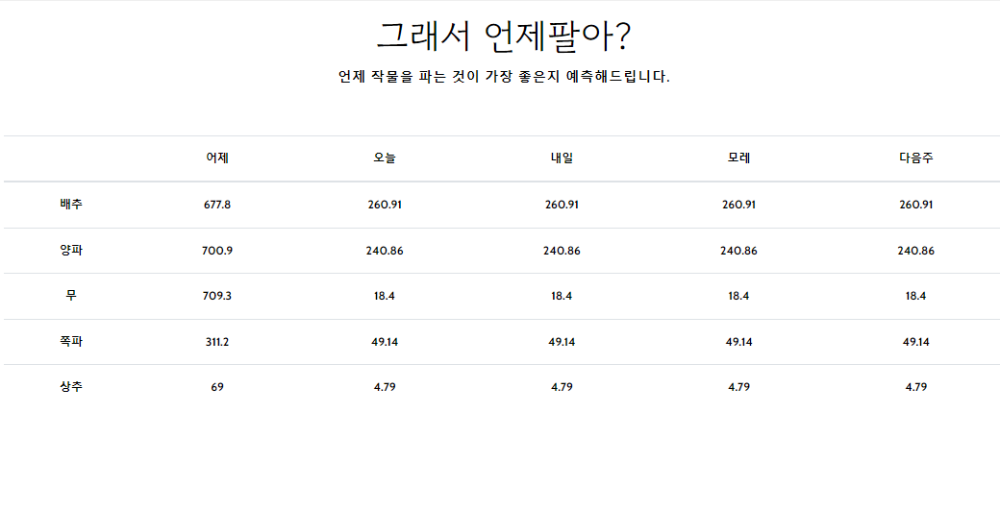
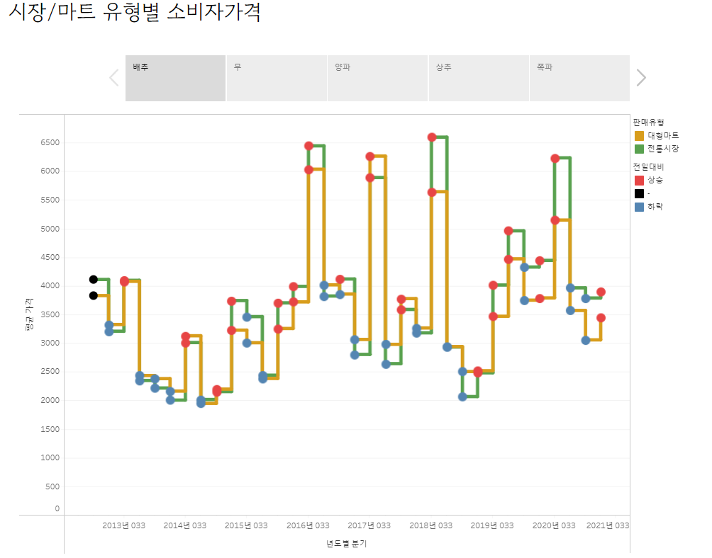
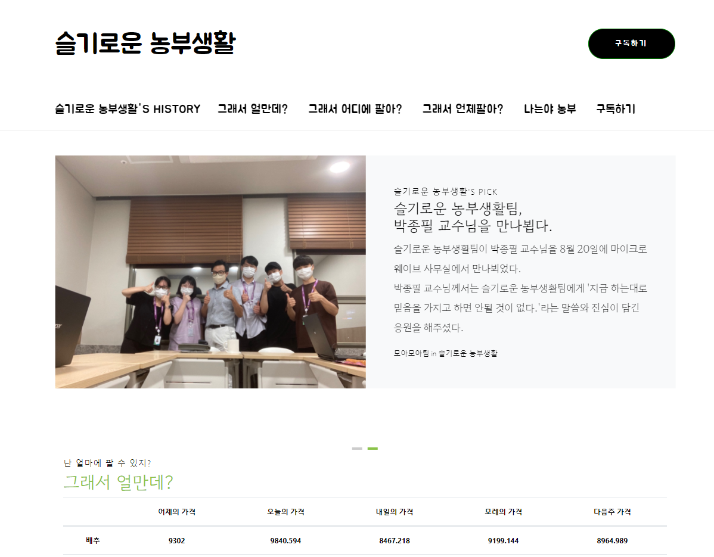
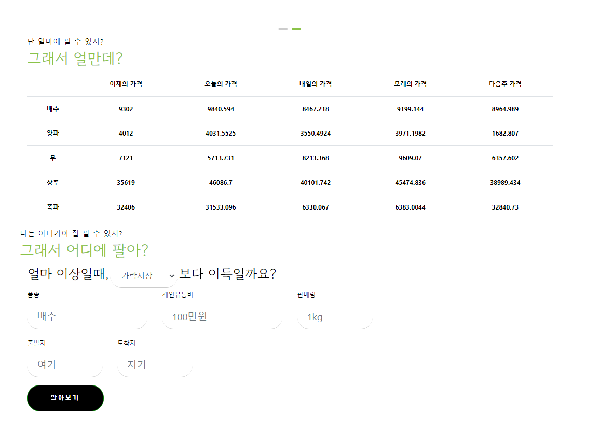
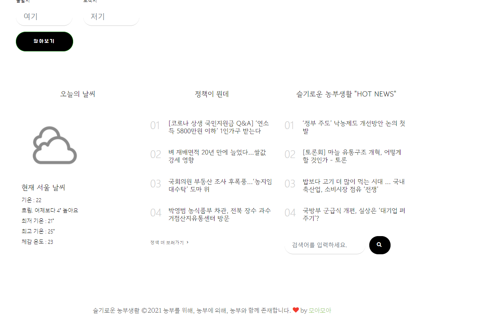

# 구독형 이메일과 웹 서비스

## 프로젝트명 : 농민들을 위한 구독형 이메일 과 웹서비스

## 프로젝트 인원 : 5명

## 사용기술 
HTML, CSS, Bootstrap, Flask, Mysql, python, ngrok(서버)

## 배경 

농산물은 유통업체를 많이 거치게 되는데 여기서 제값을 받지 못하는 경우가 발생한다. 그래서 다양한 유통 경로를 알려주고 가격예측을 통해 제값을 받게 해주고 거래량예측을 통해 언제 팔면 가장 돈을 잘 받을수 있는지 알려준다.

## 담당업무 

- flask를 이용한 웹 서버 개발
- 데이터 수집
- 데이터 분석
- 데이터 모델링
- 딥러닝을 이용한 가격예측
- 머신러닝을 이용한 거래량예측

## 사용 데이터

### 가격예측

- 공공데이터(가락시장 반입물량, 기상청 데이터)
- 농넷 & KADX(도매시장 거래정보, 가락시장 도매가격)

### 거래량예측

- 공공데이터(기상청데이터)
- 농넷 & KADX(도매시장 거래정보, 농산물 수출입 데이터)

### 소비자가격 & 온라인 트렌드 분석

- 공공데이터(한국소비자원 생필품 가격 정보 데이터, 서울 특별시 생필품 농수축산물 가격정보)
- 크롤링(쿠팡 & 이마트 몰 상품명 및 리뷰 등록 일자)

### 기타기능(손익분기점 계산기, 그외 기능)

- 크롤링(카카오 맵 길찾기 km수, 뉴스(농정신문), 정책(농민신문),날씨(네이버 날씨) )

### 이메일서비스

- 구독시 문자 발송
- 구독자의 품종의 가격예측정보
- 구독자의 품종의 거래량예측정보
- 가까운 로컬푸드 직판장 추천
- 구독자가 입력한 지역의 날씨 정보
- 오늘의 HOT 뉴스
- 인기 농산물관련 정책

다음은 실제 메일을 받았을때

### 웹서비스 
- 주소 : http://ec2-15-165-154-183.ap-northeast-2.compute.amazonaws.com:5000/
- 날씨정보
- 정책정보
- 뉴스정보
- 가격예측정보(LSTM)
- 거래량예측정보(KNN)
- 온라인 동향 정보
- 얼마이상 팔면 이득을 볼 수 있는지 계산기 제공

### 구독서비스

### 날씨, 정책, 뉴스에 대한 정보제공

### 예측정보들

- 가격예측

- 거래량예측

### 시장/마트 유형별 정보 제공

- 품종별 가격

- 유형별 정보

### 전체화면

